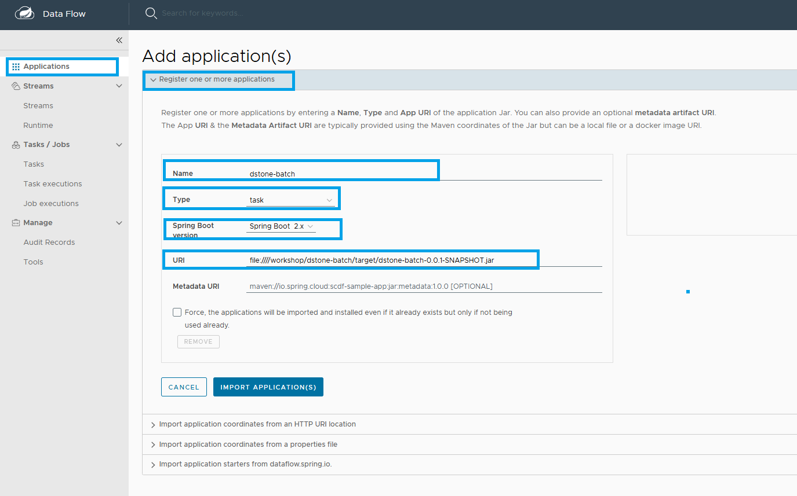
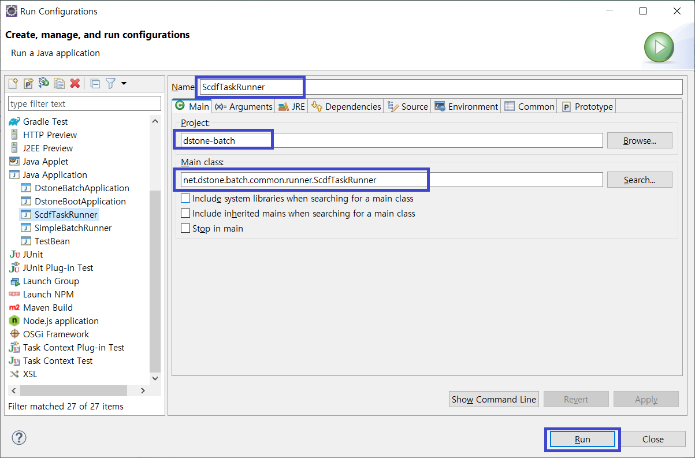
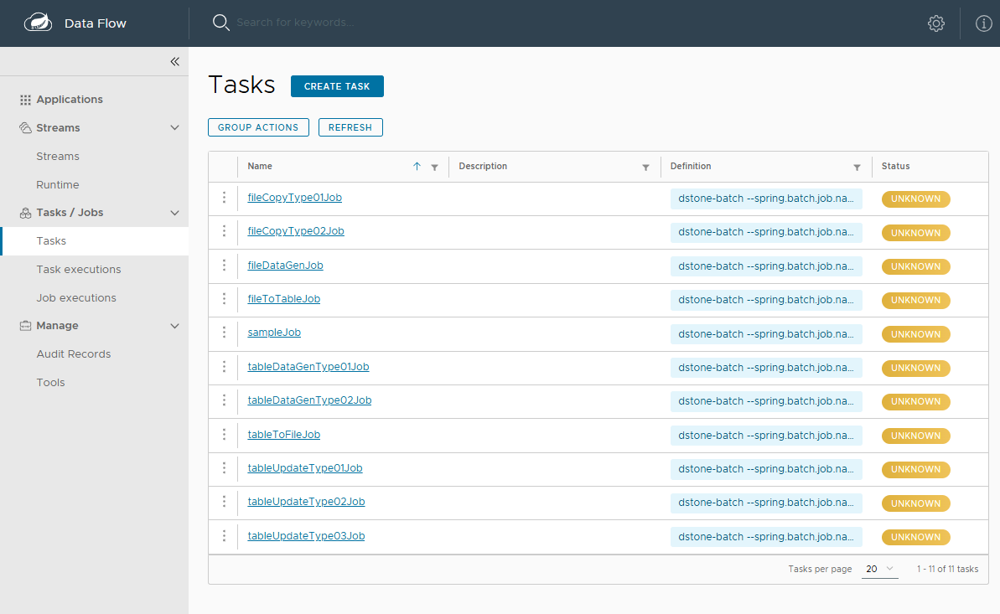
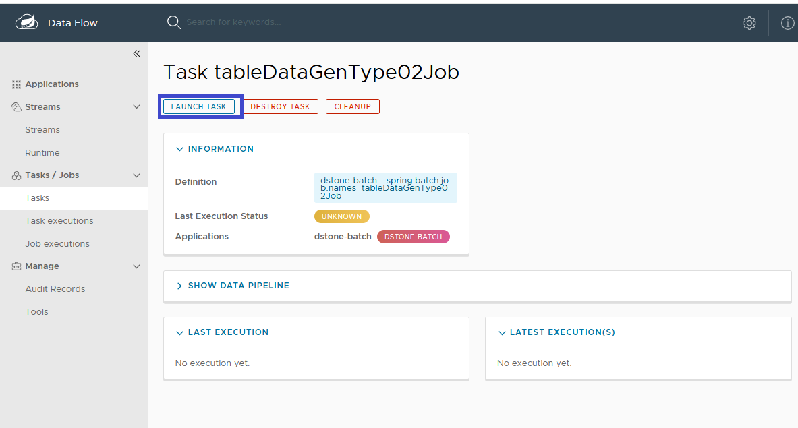
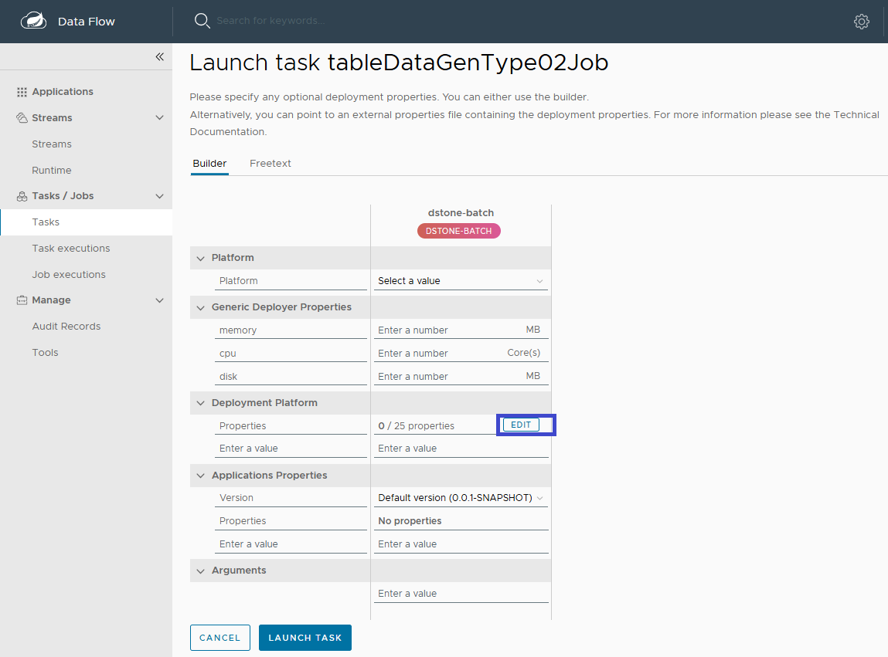
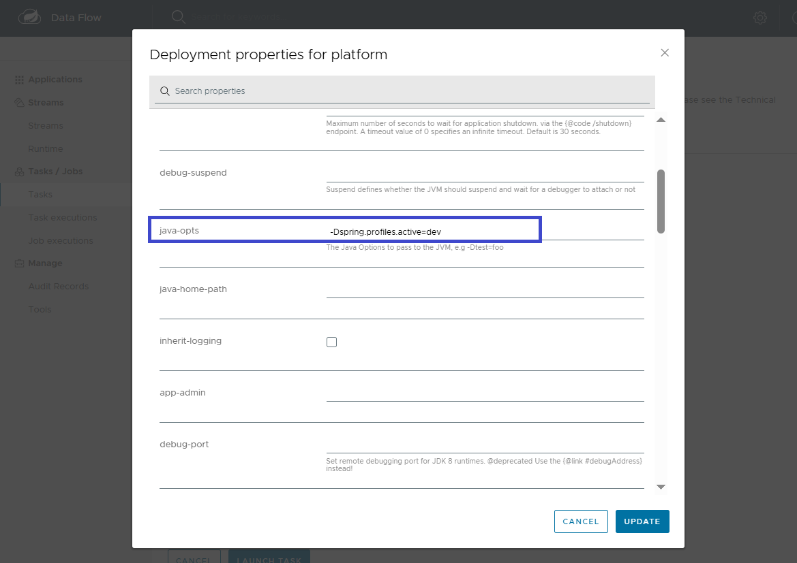
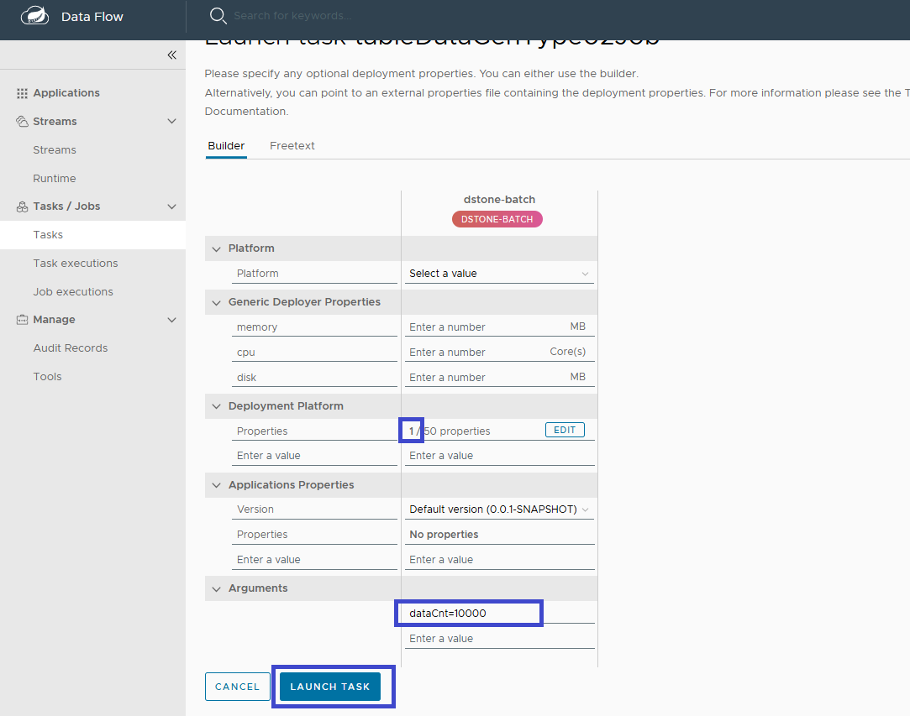
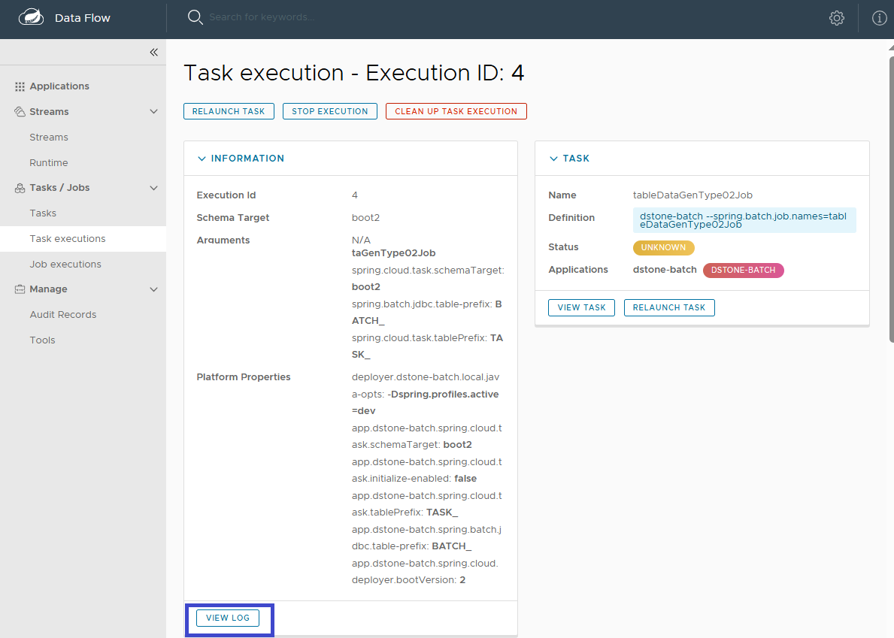
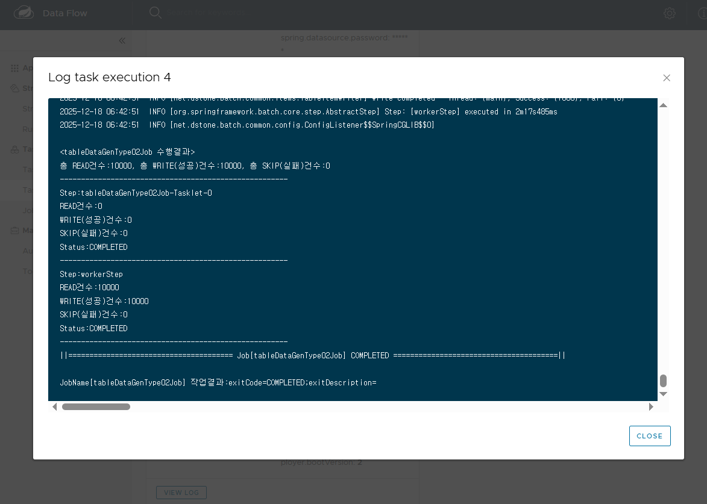

# dstone-batch-server 프로젝트 설명

## 1. 개요

이 프로젝트는 Spring Cloud Dataflow와 Spring Cloud Skipper를 사용하여 데이터 처리 파이프라인과 배치(Batch) 애플리케이션을 구축, 배포 및 관리하기 위한 서버 환경을 제공합니다. `dstone-batch-server`라는 이름에서 알 수 있듯이, 대량의 데이터를 처리하는 배치 작업을 중앙에서 관리하고 모니터링하는 것을 주 목적으로 합니다.

프로젝트는 소스 코드를 직접 빌드하는 형태가 아니라, 이미 빌드된 Spring Cloud Dataflow Server와 Skipper Server를 포함하여 실행 환경을 구성하는 데 중점을 둡니다.

## 2. 주요 구성 요소

- **Spring Cloud Dataflow Server:**
  - 배치 및 스트림 애플리케이션의 파이프라인을 생성, 배포, 관리하는 핵심 서버입니다.
  - 웹 UI와 REST API를 제공하여 사용자가 쉽게 태스크(Task)를 정의하고 실행할 수 있도록 지원합니다.
  - `modules/dataflow` 디렉토리에 실행 가능한 서버 파일이 위치합니다.

- **Spring Cloud Skipper Server:**
  - Spring Boot 애플리케이션의 생명주기(Lifecycle)를 관리하는 서버입니다.
  - Dataflow와 함께 작동하여 배치 애플리케이션의 버전 관리, 업그레이드, 롤백 등의 기능을 수행합니다.
  - `modules/skipper` 디렉토리에 실행 가능한 서버 파일이 위치합니다.

## 3. 디렉토리 구조

```
dstone-batch-server/
├───.gitignore              # Git 버전 관리에서 제외할 파일 목록
├───.project                # Eclipse 프로젝트 설정 파일
├───bin/                    # 서버 실행 및 배포 스크립트
│   ├───00.deploy.bat       # (예상) 전체 서비스 배포 스크립트 (Windows)
│   ├───01.dataflow.bat     # Dataflow 서버 실행 스크립트 (Windows)
│   ├───01.dataflow.sh      # Dataflow 서버 실행 스크립트 (Linux/macOS)
│   ├───02.skipper.bat      # Skipper 서버 실행 스크립트 (Windows)
│   └───02.skipper.sh       # Skipper 서버 실행 스크립트 (Linux/macOS)
├───conf/                   # 설정 파일
│   └───dataflow-server.yml # Dataflow 서버의 주요 설정 (DB 연결, Skipper 연동 등)
├───docs/                   # 문서
│   └───docker/             # Docker 관련 배포 파일
│       └───dstone-batch-server/
│           ├───01.dstone-batch-server-docker.yml       # Docker Compose를 이용한 서비스 정의 파일
│           ├───02.dstone-batch-server-docker-reg.sh    # (예상) Docker 이미지를 레지스트리에 등록하는 스크립트
│           └───conf/                                   # Docker 컨테이너용 설정 파일
├───modules/                # 핵심 애플리케이션 모듈
│   ├───dataflow/
│   │   └───spring-cloud-dataflow-server-2.11.5/  # Spring Cloud Dataflow 서버 실행 파일
│   └───skipper/
│       └───spring-cloud-skipper-server-2.11.5/   # Spring Cloud Skipper 서버 실행 파일
└───target/                 # (현재 비어있음) Maven/Gradle 빌드 시 결과물이 생성되는 폴더
```

## 4. 실행 흐름

1.  **환경 설정**: `conf/dataflow-server.yml` 파일에 데이터베이스 접속 정보, Skipper 서버 주소 등 운영에 필요한 설정을 구성합니다.
2.  **서버 실행**:
    - `bin` 디렉토리의 `02.skipper.bat` 또는 `02.skipper.sh`를 실행하여 Skipper 서버를 시작합니다.
    - `bin` 디렉토리의 `01.dataflow.bat` 또는 `01.dataflow.sh`를 실행하여 Dataflow 서버를 시작합니다.
3.  **서비스 이용**:
    - 웹 브라우저를 통해 Dataflow UI에 접속합니다. (기본 포트: 9393)
    - UI 또는 REST API를 사용하여 등록된 배치 애플리케이션으로 태스크를 생성하고 실행합니다.

## 5. Batch Applicaiton 등록

### 5-1. 대시보드 접속
	- http://localhost:9393/dashboard
	
### 5-2. Application 등록
	- Application 메뉴 에서 상단 [Add Application(s)] 클릭
	- Name : dstone-batch
	- Type : task
	- Spring Boot Version : Spring Boot 2x
	- URI : file:////workshop/dstone-batch/target/dstone-batch-0.0.1-SNAPSHOT.jar


### 5-3. Job(Task) 등록
	- 배치프레임웍(dstone-batch)에서 net.dstone.batch.common.runner.ScdfTaskRunner 를 이용해서 Task 자동등록.


	- 혹은 dstone-batch 서버가 올라가 있을 경우 자동등록기능을 사용.
	  http://localhost:6081/batch/regtasks
	  
### 5-4. Job(Task) 목록 조회
	- 등록된 Task 목록 조회.


### 5-5. Job(Task) 실행 Step01
	- Task 실행 Step01.


### 5-6. Job(Task) 실행 Step02
	- Deployment Platform Property [EDIT]클릭


### 5-7. Job(Task) 실행 Step03
	< Deployment Property 세팅 >
	- javaOpts : -Dspring.profiles.active=dev


### 5-8. Job(Task) 실행 Step04
	< Arguments 세팅 >
	- 배치프로그램에서 사용 할 Job Parameter 세팅. 


### 5-9. Job(Task) 실행 Step05
	< 로그 확인 >
	- [VIEW LOG]버튼 클릭


### 5-10. Job(Task) 실행 Step06
	- 로그 내용 확인



## 6. Docker 배포

`docs/docker` 디렉토리의 파일들은 이 프로젝트를 Docker 컨테이너 환경에서 실행하기 위한ものです. `01.dstone-batch-server-docker.yml` 파일은 Docker Compose를 사용하여 Dataflow와 Skipper 서버를 서비스로 정의하고 한번에 실행할 수 있도록 지원합니다. 이를 통해 개발 및 운영 환경의 일관성을 유지하고 배포를 간소화할 수 있습니다.


